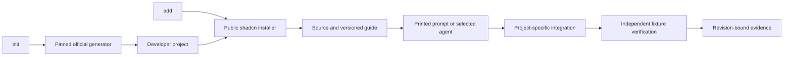

# Grounding for Payload Toolkit v4

## Overview

The current repository is a Payload v3 Next.js application with PostgreSQL, Better Auth, storage, email and a substantial frontend. The agreed next product is `payload-toolkit`, a CLI with `init` and `add` that starts from official v4 templates, installs developer-owned feature source, and hands integration to a versioned guide or the user's selected agent. Main retains the existing application. Repository layout on this branch remains a Sketch decision. Sources: [agreed scope](./progress.md), [existing application audit](./grounding-existing.md), [rationale and history](./grounding-rationale.md).

This Ground phase establishes source contracts and constraints. It does not establish runtime compatibility. The four framework/database combinations in the scope are required verification targets; the inspected generator tuple and proposed forms wrapper are candidates awaiting that verification. No fixture application, database, browser or paid-agent run occurred during Ground. [Upstream audit](./grounding-upstream.md)

## Key concepts

- The bootstrap tuple includes the executable generator version, official template commit, Payload package version and Node runtime. Pinning only the generator leaves upstream defaults moving. The inspected tuple uses `create-payload-app@4.0.0-canary.38`, Payload `4.0.0-canary.38`, template commit `a3e91f11d020907600ba27f199368869f1bb6daa` and Node at least `24.15.0`. Other template dependency ranges still need tested lockfile identities. [Upstream tuple](./grounding-upstream.md#pinned-generator-and-template-tuple)
- Payload owns collections, auth, framework routes, admin import maps and generated types. MongoDB and PostgreSQL are database choices; Drizzle is part of the PostgreSQL adapter implementation. [Existing ownership](./grounding-existing.md#current-entry-points-and-ownership), [official template definitions](https://github.com/payloadcms/payload/blob/a3e91f11d020907600ba27f199368869f1bb6daa/packages/create-payload-app/src/lib/templates.ts)
- shadcn owns registry resolution, file/dependency installation and its project transformations. Toolkit compatibility metadata and versioned guides supply Payload context. shadcn does not implement Payload configuration registration. [Public registry contract](./grounding-upstream.md#public-shadcn-registry-contract), [registry API](https://ui.shadcn.com/docs/registry/api-reference#addregistryitems)
- Installation, agent invocation and verification are separate outcomes. Installed source belongs to the developer; an agent's successful process exit is not runtime proof. [Agreed scope](./progress.md), [agent invocation facts](./grounding-rationale.md#local-agent-invocation-facts)
- Each fixture owns its directory, service/database identity, ports and evidence. Proof names the tested revision and source/guide identities and retains failed attempts. [Fixture protocol](./grounding-rationale.md#reproducible-fixture-protocol)

## Traced flow and proposed boundary

Today, `next.config.mjs:25` applies `withPayload`; `src/payload.config.ts:19-76` assembles the application. Generated REST routes and admin pages consume that config and import map. `src/collections/users.ts:8` enables native authentication, while `src/plugins/index.ts:10` additionally applies Better Auth. `src/lib/payload/get-payload.ts:1-6` returns the Better Auth wrapper, and `/api/auth` converts it into Next handlers. The existing access helpers assume plugin-added roles. This app cannot be treated as a framework-neutral native-auth base by merely hiding its login components. [Existing flow and auth](./grounding-existing.md)

For `init`, the supported delegation boundary is the pinned official generator binary. Its published internal export map does not match packaged files. The source-supported framework choices are `blank` for Next and `blank-tanstack` for TanStack Start, each with `mongodb` or `postgres`. New-project generation must run from a staging parent without existing framework markers, with an explicit URI/version/reference and `--no-git --no-agent`. Those flags prevent upstream Git commits and generated agent configuration; they do not launch or control a model. A generator exit code can accompany dependency/codegen failures, so the toolkit must inspect artifacts and validate the result before declaring initialization complete. [Executable generator audit](./grounding-upstream.md#delegate-the-executable-generator), [pinned creation source](https://github.com/payloadcms/payload/blob/a3e91f11d020907600ba27f199368869f1bb6daa/packages/create-payload-app/src/lib/create-project.ts)

For `add`, the chosen public boundary is `addRegistryItems` from pinned `shadcn@4.21.4`. Load the project's registry config and pass it explicitly. A universal item with explicit relative file targets can install a portable plugin and guide into an official blank project without requiring UI initialization. All transitive items must also qualify as universal. The API installs dependencies and files without prompts; it has no public `skipInstall`, package-manager override, dry-run or changed-file receipt. With overwrite disabled it can skip existing files, so source/guide inspection after the call is necessary before handoff. [Published API audit](./grounding-upstream.md#public-shadcn-registry-contract)

The user chooses Codex, Claude or a printed prompt. Git state is checked before installation dirties the project. Explicit dirty override records the starting state. The guide asks the agent or developer to inspect actual config, routes, schema and access policy, then integrate ordinary exported feature code. No default stash/reset/stage/commit, model override or permission bypass is authorized. CI uses deterministic fixtures and mock agents; real-agent evaluations are separately identified. [Scope](./progress.md), [agent adapters and evidence limits](./grounding-rationale.md)

This diagram is the agreed ownership flow, not an implemented pipeline.

## Forms and verification gotchas

The legacy `extra` folder is a reference for form-builder behavior, not a working installable item. The plugin and renderer registrations are commented out, its dependency is absent, and TypeScript excludes `extra`. The frontend reports success from a timer at `extra/blocks/form/component.tsx:84-105`; the persistence request is commented out at lines 107-128. Its Next imports, unavailable generated `Form` type, branded email template and role-based access helper must not leak into a portable v4 item. The active Sheet UI is a separate Base UI Dialog component. [Forms audit](./grounding-existing.md#forms-source-and-missing-integration)

The inspected v4 `formBuilderPlugin` provides forms/submissions, admin integration and relationship checks. Its defaults allow public submission creation and admin-user reads; field-specific server validation is limited for generic non-upload values. Use those defaults as inspected behavior, then verify the actual example's access and validation requirements. A proposed create-only `afterChange` notification hook can log the persisted submission identity without a provider. That hook has not yet been typechecked in a fixture. Preserve an established application's email adapter; logging proves notification invocation, not email delivery. [Plugin audit](./grounding-upstream.md#forms-ownership-and-portable-first-item), [pinned plugin source](https://github.com/payloadcms/payload/tree/a3e91f11d020907600ba27f199368869f1bb6daa/packages/plugin-form-builder)

Schemas and frontend rendering have different owners. This app has global Lexical features, collection-specific Lexical features, Lexical JSX converters and a separate array block renderer. Issue 14 records the concrete mismatch with another provider's Pages/layout integration. The guide must inspect the host instead of assuming that registering one renderer completes a feature. [Source owners](./grounding-existing.md), [issue 14](https://github.com/fluid-design-io/payload-better-auth-starter/issues/14)

Current tests use a real Next server and HTTP, an intentional boundary documented in source/history. Their execution is not portable: Bun, fixed port 3456 and a fixed Docker Postgres container/database remain mandatory. A supplied `TEST_DATABASE_URI` does not change the hardcoded truncation destination in `src/tests/helper/run.ts:52-60`. Readiness accepts 404/405; auth setup writes SQL directly and bypasses email verification links. Current tests do not cover native admin auth, forms, Mongo, TanStack, browser behavior or CLI outcomes. [Test audit](./grounding-existing.md#current-verification-and-service-infrastructure), [HTTP test history](https://github.com/fluid-design-io/payload-better-auth-starter/commit/cbb05fb)

## Preserve, change, avoid and risk

Preserve main's v3 app, native admin authentication, Payload-owned codegen, developer-owned source and the HTTP/runtime testing boundary. Preserve the distinction between installation evidence, static/build checks, database/browser behavior and provider delivery. These are agreed requirements and traced ownership, not an inference about every historic author's intention. [Scope](./progress.md), [rationale](./grounding-rationale.md)

Change the delivery unit into the CLI, versioned catalog and guides. Replace shared application fixtures with disposable, explicitly owned projects/databases and Docker-or-supplied-service adapters. Generate framework types before checking a fresh fixture. Exercise the installed package/registry as delivered and bind reports to the exact tested identities. [Historical fresh-checkout check](https://github.com/fluid-design-io/payload-better-auth-starter/commit/6c819ba), [verification requirements](./grounding-upstream.md#proof-still-required)

Avoid a universal hardcoded Payload wiring language, unexported upstream APIs, silent file skips, demo-only forms success, copied Better Auth role assumptions, branded recipients, unnecessary mail/storage fixtures and cleanup based only on a `_test` name. Avoid treating a model message or a later successful rerun as proof that a failed attempt never occurred. [Existing constraints](./grounding-existing.md#constraints-for-the-sketches), [rationale constraints](./grounding-rationale.md#design-conclusions-and-evidence-limits)

Risks include upstream canary changes, ranged dependency drift, package installation scripts, guide omissions, changed access policies, conflicting package-manager markers and dirty existing projects. Published `payload-auth@3.0.0` excludes Payload v4 and requires Next; an agent cannot waive that eligibility gate. Unknown fixture behavior must remain unknown until execution. [Auth peer metadata](https://registry.npmjs.org/payload-auth/3.0.0), [upstream audit](./grounding-upstream.md), [rationale](./grounding-rationale.md)

## Files, sources and confidence

Start with `src/payload.config.ts`, `src/collections/users.ts`, `src/plugins/index.ts`, `extra/plugins/form-plugin/index.ts`, `extra/blocks/form/component.tsx` and `src/tests/helper/run.ts` for the existing application. Start with the pinned upstream generator/templates, `shadcn/registry` and form-builder package for the new implementation contracts. Full file/source inventories and exact line references are in [existing](./grounding-existing.md), [upstream](./grounding-upstream.md) and [rationale](./grounding-rationale.md) reports. Those reports and [scope](./progress.md) were read in full; the fake submission and fixed truncation code were spot-checked again during synthesis. Candidate designs were not read.

Source-control and issue evidence covers the focused local history, issue 14 and PR 16 described in the rationale report. Local documents cover this conversation's scope and the grounding reports. No private Drive/Notion/mail or real-time chat records were searched. No project observability, exception tracker or analytics evidence was examined, so these reports do not establish production failure rates, performance or user demand. Installed agent help establishes syntax only. There was no remote mutation or runtime/provider validation. [Coverage map](./grounding-rationale.md#coverage-map)

Confidence is high in the traced source shape and published options because the reports inspected executable source and package declarations. The proposal to use a thin installer plus contextual guides is an agreed design direction, supported by those boundaries; its operational success remains unproven. Root package versus monorepo placement, collision recovery details and executable fixture behavior are open Sketch/verification work, not silently settled by Ground.

HOW/WHY synthesis followed the pinned [HOW template](https://github.com/cursor/plugins/blob/d0ef80d86795816da932a153458c5dbe192d294e/pstack/skills/how/references/explainer-prompt.md), [WHY template](https://github.com/cursor/plugins/blob/d0ef80d86795816da932a153458c5dbe192d294e/pstack/skills/why/references/synthesizer-prompt.md) and WHY confidence framework. Local skill files were read; the two missing local templates were retrieved from that exact revision. The parent authorized this documentation write despite the templates' default read-only posture.
